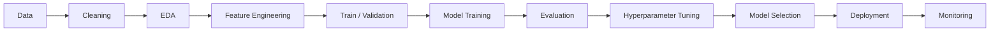

[README.md](https://github.com/user-attachments/files/30869252/README.md)

![Uploading mmd<svg xmlns="http://www.w3.org/2000/svg" width="840" height="1070" viewBox="0 0 840 1070" font-family="ui-monospace, SFMono-Regular, Menlo, Consolas, monospace"><defs><linearGradient id="bg" x1="0" y1="0" x2="0" y2="1"><stop offset="0" stop-color="#111722"/><stop offset="1" stop-color="#0d1117"/></linearGradient></defs><rect width="840" height="1070" rx="12" fill="url(#bg)"/><rect x="0.5" y="0.5" width="839" height="1069" rx="12" fill="none" stroke="#30363d" stroke-width="1"/><line x1="0" y1="30" x2="840" y2="30" stroke="#30363d"/><circle cx="20" cy="15.0" r="5" fill="#ff5f56"/><circle cx="36" cy="15.0" r="5" fill="#ffbd2e"/><circle cx="52" cy="15.0" r="5" fill="#27c93f"/><text x="420.0" y="19.0" fill="#7d8590" font-size="12" text-anchor="middle">mmd607@github: ~$ ./portrait.sh</text><clipPath id="r0"><rect x="20" y="37.0" height="15" width="0"><animate attributeName="width" from="0" to="800" begin="0.000s" dur="0.11s" fill="freeze"/></rect></clipPath><g clip-path="url(#r0)"><text xml:space="preserve" x="20" y="48.1" fill="#c9d1d9" font-size="12.9" textLength="800" lengthAdjust="spacing">                                                                                                    </text></g><rect y="38.0" width="8" height="13" fill="#c9d1d9" opacity="0"><animate attributeName="x" from="20" to="820" begin="0.000s" dur="0.11s" fill="freeze"/><set attributeName="opacity" to="0.85" begin="0.000s"/><set attributeName="opacity" to="0" begin="0.110s"/></rect><clipPath id="r1"><rect x="20" y="52.0" height="15" width="0"><animate attributeName="width" from="0" to="800" begin="0.110s" dur="0.11s" fill="freeze"/></rect></clipPath><g clip-path="url(#r1)"><text xml:space="preserve" x="20" y="63.1" fill="#c9d1d9" font-size="12.9" textLength="800" lengthAdjust="spacing">                                                                                                    </text></g><rect y="53.0" width="8" height="13" fill="#c9d1d9" opacity="0"><animate attributeName="x" from="20" to="820" begin="0.110s" dur="0.11s" fill="freeze"/><set attributeName="opacity" to="0.85" begin="0.110s"/><set attributeName="opacity" to="0" begin="0.220s"/></rect><clipPath id="r2"><rect x="20" y="67.0" height="15" width="0"><animate attributeName="width" from="0" to="800" begin="0.220s" dur="0.11s" fill="freeze"/></rect></clipPath><g clip-path="url(#r2)"><text xml:space="preserve" x="20" y="78.1" fill="#c9d1d9" font-size="12.9" textLength="800" lengthAdjust="spacing">                                                                                                    </text></g><rect y="68.0" width="8" height="13" fill="#c9d1d9" opacity="0"><animate attributeName="x" from="20" to="820" begin="0.220s" dur="0.11s" fill="freeze"/><set attributeName="opacity" to="0.85" begin="0.220s"/><set attributeName="opacity" to="0" begin="0.330s"/></rect><clipPath id="r3"><rect x="20" y="82.0" height="15" width="0"><animate attributeName="width" from="0" to="800" begin="0.330s" dur="0.11s" fill="freeze"/></rect></clipPath><g clip-path="url(#r3)"><text xml:space="preserve" x="20" y="93.1" fill="#c9d1d9" font-size="12.9" textLength="800" lengthAdjust="spacing">                                                                                                    </text></g><rect y="83.0" width="8" height="13" fill="#c9d1d9" opacity="0"><animate attributeName="x" from="20" to="820" begin="0.330s" dur="0.11s" fill="freeze"/><set attributeName="opacity" to="0.85" begin="0.330s"/><set attributeName="opacity" to="0" begin="0.440s"/></rect><clipPath id="r4"><rect x="20" y="97.0" height="15" width="0"><animate attributeName="width" from="0" to="800" begin="0.440s" dur="0.11s" fill="freeze"/></rect></clipPath><g clip-path="url(#r4)"><text xml:space="preserve" x="20" y="108.1" fill="#c9d1d9" font-size="12.9" textLength="800" lengthAdjust="spacing">                                                                                                    </text></g><rect y="98.0" width="8" height="13" fill="#c9d1d9" opacity="0"><animate attributeName="x" from="20" to="820" begin="0.440s" dur="0.11s" fill="freeze"/><set attributeName="opacity" to="0.85" begin="0.440s"/><set attributeName="opacity" to="0" begin="0.550s"/></rect><clipPath id="r5"><rect x="20" y="112.0" height="15" width="0"><animate attributeName="width" from="0" to="800" begin="0.550s" dur="0.11s" fill="freeze"/></rect></clipPath><g clip-path="url(#r5)"><text xml:space="preserve" x="20" y="123.1" fill="#c9d1d9" font-size="12.9" textLength="800" lengthAdjust="spacing">                                                                                                    </text></g><rect y="113.0" width="8" height="13" fill="#c9d1d9" opacity="0"><animate attributeName="x" from="20" to="820" begin="0.550s" dur="0.11s" fill="freeze"/><set attributeName="opacity" to="0.85" begin="0.550s"/><set attributeName="opacity" to="0" begin="0.660s"/></rect><clipPath id="r6"><rect x="20" y="127.0" height="15" width="0"><animate attributeName="width" from="0" to="800" begin="0.660s" dur="0.11s" fill="freeze"/></rect></clipPath><g clip-path="url(#r6)"><text xml:space="preserve" x="20" y="138.1" fill="#c9d1d9" font-size="12.9" textLength="800" lengthAdjust="spacing">                                                                                                    </text></g><rect y="128.0" width="8" height="13" fill="#c9d1d9" opacity="0"><animate attributeName="x" from="20" to="820" begin="0.660s" dur="0.11s" fill="freeze"/><set attributeName="opacity" to="0.85" begin="0.660s"/><set attributeName="opacity" to="0" begin="0.770s"/></rect><clipPath id="r7"><rect x="20" y="142.0" height="15" width="0"><animate attributeName="width" from="0" to="800" begin="0.770s" dur="0.11s" fill="freeze"/></rect></clipPath><g clip-path="url(#r7)"><text xml:space="preserve" x="20" y="153.1" fill="#c9d1d9" font-size="12.9" textLength="800" lengthAdjust="spacing">                                                                                                    </text></g><rect y="143.0" width="8" height="13" fill="#c9d1d9" opacity="0"><animate attributeName="x" from="20" to="820" begin="0.770s" dur="0.11s" fill="freeze"/><set attributeName="opacity" to="0.85" begin="0.770s"/><set attributeName="opacity" to="0" begin="0.880s"/></rect><clipPath id="r8"><rect x="20" y="157.0" height="15" width="0"><animate attributeName="width" from="0" to="800" begin="0.880s" dur="0.11s" fill="freeze"/></rect></clipPath><g clip-path="url(#r8)"><text xml:space="preserve" x="20" y="168.1" fill="#c9d1d9" font-size="12.9" textLength="800" lengthAdjust="spacing">                                                                                                    </text></g><rect y="158.0" width="8" height="13" fill="#c9d1d9" opacity="0"><animate attributeName="x" from="20" to="820" begin="0.880s" dur="0.11s" fill="freeze"/><set attributeName="opacity" to="0.85" begin="0.880s"/><set attributeName="opacity" to="0" begin="0.990s"/></rect><clipPath id="r9"><rect x="20" y="172.0" height="15" width="0"><animate attributeName="width" from="0" to="800" begin="0.990s" dur="0.11s" fill="freeze"/></rect></clipPath><g clip-path="url(#r9)"><text xml:space="preserve" x="20" y="183.1" fill="#c9d1d9" font-size="12.9" textLength="800" lengthAdjust="spacing">                                                                                                    </text></g><rect y="173.0" width="8" height="13" fill="#c9d1d9" opacity="0"><animate attributeName="x" from="20" to="820" begin="0.990s" dur="0.11s" fill="freeze"/><set attributeName="opacity" to="0.85" begin="0.990s"/><set attributeName="opacity" to="0" begin="1.100s"/></rect><clipPath id="r10"><rect x="20" y="187.0" height="15" width="0"><animate attributeName="width" from="0" to="800" begin="1.100s" dur="0.11s" fill="freeze"/></rect></clipPath><g clip-path="url(#r10)"><text xml:space="preserve" x="20" y="198.1" fill="#c9d1d9" font-size="12.9" textLength="800" lengthAdjust="spacing">                                                                                                    </text></g><rect y="188.0" width="8" height="13" fill="#c9d1d9" opacity="0"><animate attributeName="x" from="20" to="820" begin="1.100s" dur="0.11s" fill="freeze"/><set attributeName="opacity" to="0.85" begin="1.100s"/><set attributeName="opacity" to="0" begin="1.210s"/></rect><clipPath id="r11"><rect x="20" y="202.0" height="15" width="0"><animate attributeName="width" from="0" to="800" begin="1.210s" dur="0.11s" fill="freeze"/></rect></clipPath><g clip-path="url(#r11)"><text xml:space="preserve" x="20" y="213.1" fill="#c9d1d9" font-size="12.9" textLength="800" lengthAdjust="spacing">                                                                                                    </text></g><rect y="203.0" width="8" height="13" fill="#c9d1d9" opacity="0"><animate attributeName="x" from="20" to="820" begin="1.210s" dur="0.11s" fill="freeze"/><set attributeName="opacity" to="0.85" begin="1.210s"/><set attributeName="opacity" to="0" begin="1.320s"/></rect><clipPath id="r12"><rect x="20" y="217.0" height="15" width="0"><animate attributeName="width" from="0" to="800" begin="1.320s" dur="0.11s" fill="freeze"/></rect></clipPath><g clip-path="url(#r12)"><text xml:space="preserve" x="20" y="228.1" fill="#c9d1d9" font-size="12.9" textLength="800" lengthAdjust="spacing">                                                                                                    </text></g><rect y="218.0" width="8" height="13" fill="#c9d1d9" opacity="0"><animate attributeName="x" from="20" to="820" begin="1.320s" dur="0.11s" fill="freeze"/><set attributeName="opacity" to="0.85" begin="1.320s"/><set attributeName="opacity" to="0" begin="1.430s"/></rect><clipPath id="r13"><rect x="20" y="232.0" height="15" width="0"><animate attributeName="width" from="0" to="800" begin="1.430s" dur="0.11s" fill="freeze"/></rect></clipPath><g clip-path="url(#r13)"><text xml:space="preserve" x="20" y="243.1" fill="#c9d1d9" font-size="12.9" textLength="800" lengthAdjust="spacing">                                                                                                    </text></g><rect y="233.0" width="8" height="13" fill="#c9d1d9" opacity="0"><animate attributeName="x" from="20" to="820" begin="1.430s" dur="0.11s" fill="freeze"/><set attributeName="opacity" to="0.85" begin="1.430s"/><set attributeName="opacity" to="0" begin="1.540s"/></rect><clipPath id="r14"><rect x="20" y="247.0" height="15" width="0"><animate attributeName="width" from="0" to="800" begin="1.540s" dur="0.11s" fill="freeze"/></rect></clipPath><g clip-path="url(#r14)"><text xml:space="preserve" x="20" y="258.1" fill="#c9d1d9" font-size="12.9" textLength="800" lengthAdjust="spacing">                                                                                                    </text></g><rect y="248.0" width="8" height="13" fill="#c9d1d9" opacity="0"><animate attributeName="x" from="20" to="820" begin="1.540s" dur="0.11s" fill="freeze"/><set attributeName="opacity" to="0.85" begin="1.540s"/><set attributeName="opacity" to="0" begin="1.650s"/></rect><clipPath id="r15"><rect x="20" y="262.0" height="15" width="0"><animate attributeName="width" from="0" to="800" begin="1.650s" dur="0.11s" fill="freeze"/></rect></clipPath><g clip-path="url(#r15)"><text xml:space="preserve" x="20" y="273.1" fill="#c9d1d9" font-size="12.9" textLength="800" lengthAdjust="spacing">                                           -+cs##scccc+=                                            </text></g><rect y="263.0" width="8" height="13" fill="#c9d1d9" opacity="0"><animate attributeName="x" from="20" to="820" begin="1.650s" dur="0.11s" fill="freeze"/><set attributeName="opacity" to="0.85" begin="1.650s"/><set attributeName="opacity" to="0" begin="1.760s"/></rect><clipPath id="r16"><rect x="20" y="277.0" height="15" width="0"><animate attributeName="width" from="0" to="800" begin="1.760s" dur="0.11s" fill="freeze"/></rect></clipPath><g clip-path="url(#r16)"><text xml:space="preserve" x="20" y="288.1" fill="#c9d1d9" font-size="12.9" textLength="800" lengthAdjust="spacing">                                        +cs%@@@@@@@@%@@@sc+:                                        </text></g><rect y="278.0" width="8" height="13" fill="#c9d1d9" opacity="0"><animate attributeName="x" from="20" to="820" begin="1.760s" dur="0.11s" fill="freeze"/><set attributeName="opacity" to="0.85" begin="1.760s"/><set attributeName="opacity" to="0" begin="1.870s"/></rect><clipPath id="r17"><rect x="20" y="292.0" height="15" width="0"><animate attributeName="width" from="0" to="800" begin="1.870s" dur="0.11s" fill="freeze"/></rect></clipPath><g clip-path="url(#r17)"><text xml:space="preserve" x="20" y="303.1" fill="#c9d1d9" font-size="12.9" textLength="800" lengthAdjust="spacing">                                       +%@@@%%@%%%%%%%%@@@%%*                                       </text></g><rect y="293.0" width="8" height="13" fill="#c9d1d9" opacity="0"><animate attributeName="x" from="20" to="820" begin="1.870s" dur="0.11s" fill="freeze"/><set attributeName="opacity" to="0.85" begin="1.870s"/><set attributeName="opacity" to="0" begin="1.980s"/></rect><clipPath id="r18"><rect x="20" y="307.0" height="15" width="0"><animate attributeName="width" from="0" to="800" begin="1.980s" dur="0.11s" fill="freeze"/></rect></clipPath><g clip-path="url(#r18)"><text xml:space="preserve" x="20" y="318.1" fill="#c9d1d9" font-size="12.9" textLength="800" lengthAdjust="spacing">                                       c%%%%@@@@@@@@@%%%@%#%@*                                      </text></g><rect y="308.0" width="8" height="13" fill="#c9d1d9" opacity="0"><animate attributeName="x" from="20" to="820" begin="1.980s" dur="0.11s" fill="freeze"/><set attributeName="opacity" to="0.85" begin="1.980s"/><set attributeName="opacity" to="0" begin="2.090s"/></rect><clipPath id="r19"><rect x="20" y="322.0" height="15" width="0"><animate attributeName="width" from="0" to="800" begin="2.090s" dur="0.11s" fill="freeze"/></rect></clipPath><g clip-path="url(#r19)"><text xml:space="preserve" x="20" y="333.1" fill="#c9d1d9" font-size="12.9" textLength="800" lengthAdjust="spacing">                                       *@c=+csss#%%@@@%%@%%%%%=                                     </text></g><rect y="323.0" width="8" height="13" fill="#c9d1d9" opacity="0"><animate attributeName="x" from="20" to="820" begin="2.090s" dur="0.11s" fill="freeze"/><set attributeName="opacity" to="0.85" begin="2.090s"/><set attributeName="opacity" to="0" begin="2.200s"/></rect><clipPath id="r20"><rect x="20" y="337.0" height="15" width="0"><animate attributeName="width" from="0" to="800" begin="2.200s" dur="0.11s" fill="freeze"/></rect></clipPath><g clip-path="url(#r20)"><text xml:space="preserve" x="20" y="348.1" fill="#c9d1d9" font-size="12.9" textLength="800" lengthAdjust="spacing">                                       =c:++++**cs#%@@@@@%%%%@+                                     </text></g><rect y="338.0" width="8" height="13" fill="#c9d1d9" opacity="0"><animate attributeName="x" from="20" to="820" begin="2.200s" dur="0.11s" fill="freeze"/><set attributeName="opacity" to="0.85" begin="2.200s"/><set attributeName="opacity" to="0" begin="2.310s"/></rect><clipPath id="r21"><rect x="20" y="352.0" height="15" width="0"><animate attributeName="width" from="0" to="800" begin="2.310s" dur="0.11s" fill="freeze"/></rect></clipPath><g clip-path="url(#r21)"><text xml:space="preserve" x="20" y="363.1" fill="#c9d1d9" font-size="12.9" textLength="800" lengthAdjust="spacing">                                       =++++++*ccc*c#@@@%%%%%%-                                     </text></g><rect y="353.0" width="8" height="13" fill="#c9d1d9" opacity="0"><animate attributeName="x" from="20" to="820" begin="2.310s" dur="0.11s" fill="freeze"/><set attributeName="opacity" to="0.85" begin="2.310s"/><set attributeName="opacity" to="0" begin="2.420s"/></rect><clipPath id="r22"><rect x="20" y="367.0" height="15" width="0"><animate attributeName="width" from="0" to="800" begin="2.420s" dur="0.11s" fill="freeze"/></rect></clipPath><g clip-path="url(#r22)"><text xml:space="preserve" x="20" y="378.1" fill="#c9d1d9" font-size="12.9" textLength="800" lengthAdjust="spacing">                                       *%%s*s%%%##sc*c#%%%%%%s                                      </text></g><rect y="368.0" width="8" height="13" fill="#c9d1d9" opacity="0"><animate attributeName="x" from="20" to="820" begin="2.420s" dur="0.11s" fill="freeze"/><set attributeName="opacity" to="0.85" begin="2.420s"/><set attributeName="opacity" to="0" begin="2.530s"/></rect><clipPath id="r23"><rect x="20" y="382.0" height="15" width="0"><animate attributeName="width" from="0" to="800" begin="2.530s" dur="0.11s" fill="freeze"/></rect></clipPath><g clip-path="url(#r23)"><text xml:space="preserve" x="20" y="393.1" fill="#c9d1d9" font-size="12.9" textLength="800" lengthAdjust="spacing">                                       =#%s+s%%#%%%#c**s###s#+                                      </text></g><rect y="383.0" width="8" height="13" fill="#c9d1d9" opacity="0"><animate attributeName="x" from="20" to="820" begin="2.530s" dur="0.11s" fill="freeze"/><set attributeName="opacity" to="0.85" begin="2.530s"/><set attributeName="opacity" to="0" begin="2.640s"/></rect><clipPath id="r24"><rect x="20" y="397.0" height="15" width="0"><animate attributeName="width" from="0" to="800" begin="2.640s" dur="0.11s" fill="freeze"/></rect></clipPath><g clip-path="url(#r24)"><text xml:space="preserve" x="20" y="408.1" fill="#c9d1d9" font-size="12.9" textLength="800" lengthAdjust="spacing">                                       :**+*ccsssscc***cccscc                                       </text></g><rect y="398.0" width="8" height="13" fill="#c9d1d9" opacity="0"><animate attributeName="x" from="20" to="820" begin="2.640s" dur="0.11s" fill="freeze"/><set attributeName="opacity" to="0.85" begin="2.640s"/><set attributeName="opacity" to="0" begin="2.750s"/></rect><clipPath id="r25"><rect x="20" y="412.0" height="15" width="0"><animate attributeName="width" from="0" to="800" begin="2.750s" dur="0.11s" fill="freeze"/></rect></clipPath><g clip-path="url(#r25)"><text xml:space="preserve" x="20" y="423.1" fill="#c9d1d9" font-size="12.9" textLength="800" lengthAdjust="spacing">                                       =+=+**c***********css+                                       </text></g><rect y="413.0" width="8" height="13" fill="#c9d1d9" opacity="0"><animate attributeName="x" from="20" to="820" begin="2.750s" dur="0.11s" fill="freeze"/><set attributeName="opacity" to="0.85" begin="2.750s"/><set attributeName="opacity" to="0" begin="2.860s"/></rect><clipPath id="r26"><rect x="20" y="427.0" height="15" width="0"><animate attributeName="width" from="0" to="800" begin="2.860s" dur="0.11s" fill="freeze"/></rect></clipPath><g clip-path="url(#r26)"><text xml:space="preserve" x="20" y="438.1" fill="#c9d1d9" font-size="12.9" textLength="800" lengthAdjust="spacing">                                       =+c##sc****cccccc*c*c-                                       </text></g><rect y="428.0" width="8" height="13" fill="#c9d1d9" opacity="0"><animate attributeName="x" from="20" to="820" begin="2.860s" dur="0.11s" fill="freeze"/><set attributeName="opacity" to="0.85" begin="2.860s"/><set attributeName="opacity" to="0" begin="2.970s"/></rect><clipPath id="r27"><rect x="20" y="442.0" height="15" width="0"><animate attributeName="width" from="0" to="800" begin="2.970s" dur="0.11s" fill="freeze"/></rect></clipPath><g clip-path="url(#r27)"><text xml:space="preserve" x="20" y="453.1" fill="#c9d1d9" font-size="12.9" textLength="800" lengthAdjust="spacing">                                       :ccssssc**ccsssss#sc*-::===+:                                </text></g><rect y="443.0" width="8" height="13" fill="#c9d1d9" opacity="0"><animate attributeName="x" from="20" to="820" begin="2.970s" dur="0.11s" fill="freeze"/><set attributeName="opacity" to="0.85" begin="2.970s"/><set attributeName="opacity" to="0" begin="3.080s"/></rect><clipPath id="r28"><rect x="20" y="457.0" height="15" width="0"><animate attributeName="width" from="0" to="800" begin="3.080s" dur="0.11s" fill="freeze"/></rect></clipPath><g clip-path="url(#r28)"><text xml:space="preserve" x="20" y="468.1" fill="#c9d1d9" font-size="12.9" textLength="800" lengthAdjust="spacing">                                       -csss##sccsssss#s#s#%%%%@@%@#-                               </text></g><rect y="458.0" width="8" height="13" fill="#c9d1d9" opacity="0"><animate attributeName="x" from="20" to="820" begin="3.080s" dur="0.11s" fill="freeze"/><set attributeName="opacity" to="0.85" begin="3.080s"/><set attributeName="opacity" to="0" begin="3.190s"/></rect><clipPath id="r29"><rect x="20" y="472.0" height="15" width="0"><animate attributeName="width" from="0" to="800" begin="3.190s" dur="0.11s" fill="freeze"/></rect></clipPath><g clip-path="url(#r29)"><text xml:space="preserve" x="20" y="483.1" fill="#c9d1d9" font-size="12.9" textLength="800" lengthAdjust="spacing">                                        :ccssssss###%%%%%@@@%%%%%%%%c                               </text></g><rect y="473.0" width="8" height="13" fill="#c9d1d9" opacity="0"><animate attributeName="x" from="20" to="820" begin="3.190s" dur="0.11s" fill="freeze"/><set attributeName="opacity" to="0.85" begin="3.190s"/><set attributeName="opacity" to="0" begin="3.300s"/></rect><clipPath id="r30"><rect x="20" y="487.0" height="15" width="0"><animate attributeName="width" from="0" to="800" begin="3.300s" dur="0.11s" fill="freeze"/></rect></clipPath><g clip-path="url(#r30)"><text xml:space="preserve" x="20" y="498.1" fill="#c9d1d9" font-size="12.9" textLength="800" lengthAdjust="spacing">                                         +sss##%%%@@@@@@@%%%%%@%%%%%s                               </text></g><rect y="488.0" width="8" height="13" fill="#c9d1d9" opacity="0"><animate attributeName="x" from="20" to="820" begin="3.300s" dur="0.11s" fill="freeze"/><set attributeName="opacity" to="0.85" begin="3.300s"/><set attributeName="opacity" to="0" begin="3.410s"/></rect><clipPath id="r31"><rect x="20" y="502.0" height="15" width="0"><animate attributeName="width" from="0" to="800" begin="3.410s" dur="0.11s" fill="freeze"/></rect></clipPath><g clip-path="url(#r31)"><text xml:space="preserve" x="20" y="513.1" fill="#c9d1d9" font-size="12.9" textLength="800" lengthAdjust="spacing">                                          :==+%@%%@@@@@%%%%%%%%%%%%%%-                              </text></g><rect y="503.0" width="8" height="13" fill="#c9d1d9" opacity="0"><animate attributeName="x" from="20" to="820" begin="3.410s" dur="0.11s" fill="freeze"/><set attributeName="opacity" to="0.85" begin="3.410s"/><set attributeName="opacity" to="0" begin="3.520s"/></rect><clipPath id="r32"><rect x="20" y="517.0" height="15" width="0"><animate attributeName="width" from="0" to="800" begin="3.520s" dur="0.11s" fill="freeze"/></rect></clipPath><g clip-path="url(#r32)"><text xml:space="preserve" x="20" y="528.1" fill="#c9d1d9" font-size="12.9" textLength="800" lengthAdjust="spacing">                                              :#%@@@@%@@@@%%%%%%%%%%@s=:                            </text></g><rect y="518.0" width="8" height="13" fill="#c9d1d9" opacity="0"><animate attributeName="x" from="20" to="820" begin="3.520s" dur="0.11s" fill="freeze"/><set attributeName="opacity" to="0.85" begin="3.520s"/><set attributeName="opacity" to="0" begin="3.630s"/></rect><clipPath id="r33"><rect x="20" y="532.0" height="15" width="0"><animate attributeName="width" from="0" to="800" begin="3.630s" dur="0.11s" fill="freeze"/></rect></clipPath><g clip-path="url(#r33)"><text xml:space="preserve" x="20" y="543.1" fill="#c9d1d9" font-size="12.9" textLength="800" lengthAdjust="spacing">                                              *%@@@@@@@%%%%%%%%%%%%%%@@%s-                          </text></g><rect y="533.0" width="8" height="13" fill="#c9d1d9" opacity="0"><animate attributeName="x" from="20" to="820" begin="3.630s" dur="0.11s" fill="freeze"/><set attributeName="opacity" to="0.85" begin="3.630s"/><set attributeName="opacity" to="0" begin="3.740s"/></rect><clipPath id="r34"><rect x="20" y="547.0" height="15" width="0"><animate attributeName="width" from="0" to="800" begin="3.740s" dur="0.11s" fill="freeze"/></rect></clipPath><g clip-path="url(#r34)"><text xml:space="preserve" x="20" y="558.1" fill="#c9d1d9" font-size="12.9" textLength="800" lengthAdjust="spacing">                                             *@@@@@@%%%%%%%%%%%%%%%@@%%%@=                          </text></g><rect y="548.0" width="8" height="13" fill="#c9d1d9" opacity="0"><animate attributeName="x" from="20" to="820" begin="3.740s" dur="0.11s" fill="freeze"/><set attributeName="opacity" to="0.85" begin="3.740s"/><set attributeName="opacity" to="0" begin="3.850s"/></rect><clipPath id="r35"><rect x="20" y="562.0" height="15" width="0"><animate attributeName="width" from="0" to="800" begin="3.850s" dur="0.11s" fill="freeze"/></rect></clipPath><g clip-path="url(#r35)"><text xml:space="preserve" x="20" y="573.1" fill="#c9d1d9" font-size="12.9" textLength="800" lengthAdjust="spacing">                                            +%@@@%%%%%%%%%%%%%%%%%%%%@%%%:                          </text></g><rect y="563.0" width="8" height="13" fill="#c9d1d9" opacity="0"><animate attributeName="x" from="20" to="820" begin="3.850s" dur="0.11s" fill="freeze"/><set attributeName="opacity" to="0.85" begin="3.850s"/><set attributeName="opacity" to="0" begin="3.960s"/></rect><clipPath id="r36"><rect x="20" y="577.0" height="15" width="0"><animate attributeName="width" from="0" to="800" begin="3.960s" dur="0.11s" fill="freeze"/></rect></clipPath><g clip-path="url(#r36)"><text xml:space="preserve" x="20" y="588.1" fill="#c9d1d9" font-size="12.9" textLength="800" lengthAdjust="spacing">                                           -#%%%%%%%%%%%%%%%%%%%%%%%%%@@%-                          </text></g><rect y="578.0" width="8" height="13" fill="#c9d1d9" opacity="0"><animate attributeName="x" from="20" to="820" begin="3.960s" dur="0.11s" fill="freeze"/><set attributeName="opacity" to="0.85" begin="3.960s"/><set attributeName="opacity" to="0" begin="4.070s"/></rect><clipPath id="r37"><rect x="20" y="592.0" height="15" width="0"><animate attributeName="width" from="0" to="800" begin="4.070s" dur="0.11s" fill="freeze"/></rect></clipPath><g clip-path="url(#r37)"><text xml:space="preserve" x="20" y="603.1" fill="#c9d1d9" font-size="12.9" textLength="800" lengthAdjust="spacing">                                           *%%%%%@%%%%%%%%%%%%%%%%%%%%%c-                           </text></g><rect y="593.0" width="8" height="13" fill="#c9d1d9" opacity="0"><animate attributeName="x" from="20" to="820" begin="4.070s" dur="0.11s" fill="freeze"/><set attributeName="opacity" to="0.85" begin="4.070s"/><set attributeName="opacity" to="0" begin="4.180s"/></rect><clipPath id="r38"><rect x="20" y="607.0" height="15" width="0"><animate attributeName="width" from="0" to="800" begin="4.180s" dur="0.11s" fill="freeze"/></rect></clipPath><g clip-path="url(#r38)"><text xml:space="preserve" x="20" y="618.1" fill="#c9d1d9" font-size="12.9" textLength="800" lengthAdjust="spacing">                                          :%%%%%@%%%%%%%%%%%%%%%%%%%%%%-                            </text></g><rect y="608.0" width="8" height="13" fill="#c9d1d9" opacity="0"><animate attributeName="x" from="20" to="820" begin="4.180s" dur="0.11s" fill="freeze"/><set attributeName="opacity" to="0.85" begin="4.180s"/><set attributeName="opacity" to="0" begin="4.290s"/></rect><clipPath id="r39"><rect x="20" y="622.0" height="15" width="0"><animate attributeName="width" from="0" to="800" begin="4.290s" dur="0.11s" fill="freeze"/></rect></clipPath><g clip-path="url(#r39)"><text xml:space="preserve" x="20" y="633.1" fill="#c9d1d9" font-size="12.9" textLength="800" lengthAdjust="spacing">                                          s@%%%@%%@%%@%%%%%%%%%%%@%%%%%c                            </text></g><rect y="623.0" width="8" height="13" fill="#c9d1d9" opacity="0"><animate attributeName="x" from="20" to="820" begin="4.290s" dur="0.11s" fill="freeze"/><set attributeName="opacity" to="0.85" begin="4.290s"/><set attributeName="opacity" to="0" begin="4.400s"/></rect><clipPath id="r40"><rect x="20" y="637.0" height="15" width="0"><animate attributeName="width" from="0" to="800" begin="4.400s" dur="0.11s" fill="freeze"/></rect></clipPath><g clip-path="url(#r40)"><text xml:space="preserve" x="20" y="648.1" fill="#c9d1d9" font-size="12.9" textLength="800" lengthAdjust="spacing">                                         +@%%%@@%@@@@%%%%%%%%%%%%%@@%@%%-                           </text></g><rect y="638.0" width="8" height="13" fill="#c9d1d9" opacity="0"><animate attributeName="x" from="20" to="820" begin="4.400s" dur="0.11s" fill="freeze"/><set attributeName="opacity" to="0.85" begin="4.400s"/><set attributeName="opacity" to="0" begin="4.510s"/></rect><clipPath id="r41"><rect x="20" y="652.0" height="15" width="0"><animate attributeName="width" from="0" to="800" begin="4.510s" dur="0.11s" fill="freeze"/></rect></clipPath><g clip-path="url(#r41)"><text xml:space="preserve" x="20" y="663.1" fill="#c9d1d9" font-size="12.9" textLength="800" lengthAdjust="spacing">                                        -%%%%%@@@@@@%@%%%%%%%%%%%@%%@@@@=                           </text></g><rect y="653.0" width="8" height="13" fill="#c9d1d9" opacity="0"><animate attributeName="x" from="20" to="820" begin="4.510s" dur="0.11s" fill="freeze"/><set attributeName="opacity" to="0.85" begin="4.510s"/><set attributeName="opacity" to="0" begin="4.620s"/></rect><clipPath id="r42"><rect x="20" y="667.0" height="15" width="0"><animate attributeName="width" from="0" to="800" begin="4.620s" dur="0.11s" fill="freeze"/></rect></clipPath><g clip-path="url(#r42)"><text xml:space="preserve" x="20" y="678.1" fill="#c9d1d9" font-size="12.9" textLength="800" lengthAdjust="spacing">                                        *@%%%%@@@@@@@@%@@%%%%%@%%%%@@@@@*                           </text></g><rect y="668.0" width="8" height="13" fill="#c9d1d9" opacity="0"><animate attributeName="x" from="20" to="820" begin="4.620s" dur="0.11s" fill="freeze"/><set attributeName="opacity" to="0.85" begin="4.620s"/><set attributeName="opacity" to="0" begin="4.730s"/></rect><clipPath id="r43"><rect x="20" y="682.0" height="15" width="0"><animate attributeName="width" from="0" to="800" begin="4.730s" dur="0.11s" fill="freeze"/></rect></clipPath><g clip-path="url(#r43)"><text xml:space="preserve" x="20" y="693.1" fill="#c9d1d9" font-size="12.9" textLength="800" lengthAdjust="spacing">                                       -%%%%%%@@@@@@@%@@@@%%%%%%%%%%@@@@s                           </text></g><rect y="683.0" width="8" height="13" fill="#c9d1d9" opacity="0"><animate attributeName="x" from="20" to="820" begin="4.730s" dur="0.11s" fill="freeze"/><set attributeName="opacity" to="0.85" begin="4.730s"/><set attributeName="opacity" to="0" begin="4.840s"/></rect><clipPath id="r44"><rect x="20" y="697.0" height="15" width="0"><animate attributeName="width" from="0" to="800" begin="4.840s" dur="0.11s" fill="freeze"/></rect></clipPath><g clip-path="url(#r44)"><text xml:space="preserve" x="20" y="708.1" fill="#c9d1d9" font-size="12.9" textLength="800" lengthAdjust="spacing">                                       *@%%@%%@@@@@%%@@@@@@@%%%%%%@%@@@@#                           </text></g><rect y="698.0" width="8" height="13" fill="#c9d1d9" opacity="0"><animate attributeName="x" from="20" to="820" begin="4.840s" dur="0.11s" fill="freeze"/><set attributeName="opacity" to="0.85" begin="4.840s"/><set attributeName="opacity" to="0" begin="4.950s"/></rect><clipPath id="r45"><rect x="20" y="712.0" height="15" width="0"><animate attributeName="width" from="0" to="800" begin="4.950s" dur="0.11s" fill="freeze"/></rect></clipPath><g clip-path="url(#r45)"><text xml:space="preserve" x="20" y="723.1" fill="#c9d1d9" font-size="12.9" textLength="800" lengthAdjust="spacing">                                       #%%@@%%@@@@%%@@@%%%%%@%%%%%%%@@%@#                           </text></g><rect y="713.0" width="8" height="13" fill="#c9d1d9" opacity="0"><animate attributeName="x" from="20" to="820" begin="4.950s" dur="0.11s" fill="freeze"/><set attributeName="opacity" to="0.85" begin="4.950s"/><set attributeName="opacity" to="0" begin="5.060s"/></rect><clipPath id="r46"><rect x="20" y="727.0" height="15" width="0"><animate attributeName="width" from="0" to="800" begin="5.060s" dur="0.11s" fill="freeze"/></rect></clipPath><g clip-path="url(#r46)"><text xml:space="preserve" x="20" y="738.1" fill="#c9d1d9" font-size="12.9" textLength="800" lengthAdjust="spacing">                                      :%%@@@%@@@@@%@@%%%%%%%%%%%%%%%@@%@#                           </text></g><rect y="728.0" width="8" height="13" fill="#c9d1d9" opacity="0"><animate attributeName="x" from="20" to="820" begin="5.060s" dur="0.11s" fill="freeze"/><set attributeName="opacity" to="0.85" begin="5.060s"/><set attributeName="opacity" to="0" begin="5.170s"/></rect><clipPath id="r47"><rect x="20" y="742.0" height="15" width="0"><animate attributeName="width" from="0" to="800" begin="5.170s" dur="0.11s" fill="freeze"/></rect></clipPath><g clip-path="url(#r47)"><text xml:space="preserve" x="20" y="753.1" fill="#c9d1d9" font-size="12.9" textLength="800" lengthAdjust="spacing">                                      =@%@@@%@@@@@%@@@@@%%%%%%%%%%%%@@%@#                           </text></g><rect y="743.0" width="8" height="13" fill="#c9d1d9" opacity="0"><animate attributeName="x" from="20" to="820" begin="5.170s" dur="0.11s" fill="freeze"/><set attributeName="opacity" to="0.85" begin="5.170s"/><set attributeName="opacity" to="0" begin="5.280s"/></rect><clipPath id="r48"><rect x="20" y="757.0" height="15" width="0"><animate attributeName="width" from="0" to="800" begin="5.280s" dur="0.11s" fill="freeze"/></rect></clipPath><g clip-path="url(#r48)"><text xml:space="preserve" x="20" y="768.1" fill="#c9d1d9" font-size="12.9" textLength="800" lengthAdjust="spacing">                                      *@%@@@@@@@@@@@%%%@@@@%%%%%%%%%@%%@#                           </text></g><rect y="758.0" width="8" height="13" fill="#c9d1d9" opacity="0"><animate attributeName="x" from="20" to="820" begin="5.280s" dur="0.11s" fill="freeze"/><set attributeName="opacity" to="0.85" begin="5.280s"/><set attributeName="opacity" to="0" begin="5.390s"/></rect><clipPath id="r49"><rect x="20" y="772.0" height="15" width="0"><animate attributeName="width" from="0" to="800" begin="5.390s" dur="0.11s" fill="freeze"/></rect></clipPath><g clip-path="url(#r49)"><text xml:space="preserve" x="20" y="783.1" fill="#c9d1d9" font-size="12.9" textLength="800" lengthAdjust="spacing">                                      #@%@@@@@@@@@@%%%%%%%%%@%%%%%%%@%%@s                           </text></g><rect y="773.0" width="8" height="13" fill="#c9d1d9" opacity="0"><animate attributeName="x" from="20" to="820" begin="5.390s" dur="0.11s" fill="freeze"/><set attributeName="opacity" to="0.85" begin="5.390s"/><set attributeName="opacity" to="0" begin="5.500s"/></rect><clipPath id="r50"><rect x="20" y="787.0" height="15" width="0"><animate attributeName="width" from="0" to="800" begin="5.500s" dur="0.11s" fill="freeze"/></rect></clipPath><g clip-path="url(#r50)"><text xml:space="preserve" x="20" y="798.1" fill="#c9d1d9" font-size="12.9" textLength="800" lengthAdjust="spacing">                                     :@%%@@@@@@@@@@@@%%%%@@@@@@@%%@@@@%@c                           </text></g><rect y="788.0" width="8" height="13" fill="#c9d1d9" opacity="0"><animate attributeName="x" from="20" to="820" begin="5.500s" dur="0.11s" fill="freeze"/><set attributeName="opacity" to="0.85" begin="5.500s"/><set attributeName="opacity" to="0" begin="5.610s"/></rect><clipPath id="r51"><rect x="20" y="802.0" height="15" width="0"><animate attributeName="width" from="0" to="800" begin="5.610s" dur="0.11s" fill="freeze"/></rect></clipPath><g clip-path="url(#r51)"><text xml:space="preserve" x="20" y="813.1" fill="#c9d1d9" font-size="12.9" textLength="800" lengthAdjust="spacing">                                     c@%@@@@@@@@@@%%%%%@@@@@%%@@@%%@@@%@s                           </text></g><rect y="803.0" width="8" height="13" fill="#c9d1d9" opacity="0"><animate attributeName="x" from="20" to="820" begin="5.610s" dur="0.11s" fill="freeze"/><set attributeName="opacity" to="0.85" begin="5.610s"/><set attributeName="opacity" to="0" begin="5.720s"/></rect><clipPath id="r52"><rect x="20" y="817.0" height="15" width="0"><animate attributeName="width" from="0" to="800" begin="5.720s" dur="0.11s" fill="freeze"/></rect></clipPath><g clip-path="url(#r52)"><text xml:space="preserve" x="20" y="828.1" fill="#c9d1d9" font-size="12.9" textLength="800" lengthAdjust="spacing">                           ---      -#@%@@@@@@@@@@%@@@@@%%%%@@@@@%%@@@@@s                           </text></g><rect y="818.0" width="8" height="13" fill="#c9d1d9" opacity="0"><animate attributeName="x" from="20" to="820" begin="5.720s" dur="0.11s" fill="freeze"/><set attributeName="opacity" to="0.85" begin="5.720s"/><set attributeName="opacity" to="0" begin="5.830s"/></rect><clipPath id="r53"><rect x="20" y="832.0" height="15" width="0"><animate attributeName="width" from="0" to="800" begin="5.830s" dur="0.11s" fill="freeze"/></rect></clipPath><g clip-path="url(#r53)"><text xml:space="preserve" x="20" y="843.1" fill="#c9d1d9" font-size="12.9" textLength="800" lengthAdjust="spacing">                        ---+*+==+ccc#@@@@@@@@@@@%%%@@@@@@@@%%%%%%%%@@@@@#                           </text></g><rect y="833.0" width="8" height="13" fill="#c9d1d9" opacity="0"><animate attributeName="x" from="20" to="820" begin="5.830s" dur="0.11s" fill="freeze"/><set attributeName="opacity" to="0.85" begin="5.830s"/><set attributeName="opacity" to="0" begin="5.940s"/></rect><clipPath id="r54"><rect x="20" y="847.0" height="15" width="0"><animate attributeName="width" from="0" to="800" begin="5.940s" dur="0.11s" fill="freeze"/></rect></clipPath><g clip-path="url(#r54)"><text xml:space="preserve" x="20" y="858.1" fill="#c9d1d9" font-size="12.9" textLength="800" lengthAdjust="spacing">                       =c*++++++*c######%%%%%%%%%%@@@@@@@@@@@@@@%@@@@@@@%-                          </text></g><rect y="848.0" width="8" height="13" fill="#c9d1d9" opacity="0"><animate attributeName="x" from="20" to="820" begin="5.940s" dur="0.11s" fill="freeze"/><set attributeName="opacity" to="0.85" begin="5.940s"/><set attributeName="opacity" to="0" begin="6.050s"/></rect><clipPath id="r55"><rect x="20" y="862.0" height="15" width="0"><animate attributeName="width" from="0" to="800" begin="6.050s" dur="0.11s" fill="freeze"/></rect></clipPath><g clip-path="url(#r55)"><text xml:space="preserve" x="20" y="873.1" fill="#c9d1d9" font-size="12.9" textLength="800" lengthAdjust="spacing">                       +c****+*c**+++*+c%%%%@%%%@@@@@@@@@@@@@@@@@%@@@@@@%-                          </text></g><rect y="863.0" width="8" height="13" fill="#c9d1d9" opacity="0"><animate attributeName="x" from="20" to="820" begin="6.050s" dur="0.11s" fill="freeze"/><set attributeName="opacity" to="0.85" begin="6.050s"/><set attributeName="opacity" to="0" begin="6.160s"/></rect><clipPath id="r56"><rect x="20" y="877.0" height="15" width="0"><animate attributeName="width" from="0" to="800" begin="6.160s" dur="0.11s" fill="freeze"/></rect></clipPath><g clip-path="url(#r56)"><text xml:space="preserve" x="20" y="888.1" fill="#c9d1d9" font-size="12.9" textLength="800" lengthAdjust="spacing">                       =cssc*c#s*c*cccc%@%%%@%@@@@@@@@@@@@@@@@@@%%@@@@@%%-                          </text></g><rect y="878.0" width="8" height="13" fill="#c9d1d9" opacity="0"><animate attributeName="x" from="20" to="820" begin="6.160s" dur="0.11s" fill="freeze"/><set attributeName="opacity" to="0.85" begin="6.160s"/><set attributeName="opacity" to="0" begin="6.270s"/></rect><clipPath id="r57"><rect x="20" y="892.0" height="15" width="0"><animate attributeName="width" from="0" to="800" begin="6.270s" dur="0.11s" fill="freeze"/></rect></clipPath><g clip-path="url(#r57)"><text xml:space="preserve" x="20" y="903.1" fill="#c9d1d9" font-size="12.9" textLength="800" lengthAdjust="spacing">                       :sscccc%@sscssss%@@@@@@@@@@@@@@@@@@@@@@@@@@@@@@%%%-                          </text></g><rect y="893.0" width="8" height="13" fill="#c9d1d9" opacity="0"><animate attributeName="x" from="20" to="820" begin="6.270s" dur="0.11s" fill="freeze"/><set attributeName="opacity" to="0.85" begin="6.270s"/><set attributeName="opacity" to="0" begin="6.380s"/></rect><clipPath id="r58"><rect x="20" y="907.0" height="15" width="0"><animate attributeName="width" from="0" to="800" begin="6.380s" dur="0.11s" fill="freeze"/></rect></clipPath><g clip-path="url(#r58)"><text xml:space="preserve" x="20" y="918.1" fill="#c9d1d9" font-size="12.9" textLength="800" lengthAdjust="spacing">                        +#######%@%%###%@@@@@@@@@@@@@@@@@@@@@@@@@@@@@@%%%:                          </text></g><rect y="908.0" width="8" height="13" fill="#c9d1d9" opacity="0"><animate attributeName="x" from="20" to="820" begin="6.380s" dur="0.11s" fill="freeze"/><set attributeName="opacity" to="0.85" begin="6.380s"/><set attributeName="opacity" to="0" begin="6.490s"/></rect><clipPath id="r59"><rect x="20" y="922.0" height="15" width="0"><animate attributeName="width" from="0" to="800" begin="6.490s" dur="0.11s" fill="freeze"/></rect></clipPath><g clip-path="url(#r59)"><text xml:space="preserve" x="20" y="933.1" fill="#c9d1d9" font-size="12.9" textLength="800" lengthAdjust="spacing">                        -+==+c##*==s@%%%@@@@@@@@@@@@@@@@@@@@@@@@@@@@@@%@%-                          </text></g><rect y="923.0" width="8" height="13" fill="#c9d1d9" opacity="0"><animate attributeName="x" from="20" to="820" begin="6.490s" dur="0.11s" fill="freeze"/><set attributeName="opacity" to="0.85" begin="6.490s"/><set attributeName="opacity" to="0" begin="6.600s"/></rect><clipPath id="r60"><rect x="20" y="937.0" height="15" width="0"><animate attributeName="width" from="0" to="800" begin="6.600s" dur="0.11s" fill="freeze"/></rect></clipPath><g clip-path="url(#r60)"><text xml:space="preserve" x="20" y="948.1" fill="#c9d1d9" font-size="12.9" textLength="800" lengthAdjust="spacing">                                   s@@@@@@@@@@@@@@@@@@@@@@@@@@@@@@@@@%%@s                           </text></g><rect y="938.0" width="8" height="13" fill="#c9d1d9" opacity="0"><animate attributeName="x" from="20" to="820" begin="6.600s" dur="0.11s" fill="freeze"/><set attributeName="opacity" to="0.85" begin="6.600s"/><set attributeName="opacity" to="0" begin="6.710s"/></rect><clipPath id="r61"><rect x="20" y="952.0" height="15" width="0"><animate attributeName="width" from="0" to="800" begin="6.710s" dur="0.11s" fill="freeze"/></rect></clipPath><g clip-path="url(#r61)"><text xml:space="preserve" x="20" y="963.1" fill="#c9d1d9" font-size="12.9" textLength="800" lengthAdjust="spacing">                                   %@@@@@@@@@@@@@@@@@@@@@@@@@@@@@@@@@%%@*                           </text></g><rect y="953.0" width="8" height="13" fill="#c9d1d9" opacity="0"><animate attributeName="x" from="20" to="820" begin="6.710s" dur="0.11s" fill="freeze"/><set attributeName="opacity" to="0.85" begin="6.710s"/><set attributeName="opacity" to="0" begin="6.820s"/></rect><clipPath id="r62"><rect x="20" y="967.0" height="15" width="0"><animate attributeName="width" from="0" to="800" begin="6.820s" dur="0.11s" fill="freeze"/></rect></clipPath><g clip-path="url(#r62)"><text xml:space="preserve" x="20" y="978.1" fill="#c9d1d9" font-size="12.9" textLength="800" lengthAdjust="spacing">                                  -%@@@@@@@@@@@@@@@@@@@@@@@@@@@@@@@@@@@@@=                          </text></g><rect y="968.0" width="8" height="13" fill="#c9d1d9" opacity="0"><animate attributeName="x" from="20" to="820" begin="6.820s" dur="0.11s" fill="freeze"/><set attributeName="opacity" to="0.85" begin="6.820s"/><set attributeName="opacity" to="0" begin="6.930s"/></rect><clipPath id="r63"><rect x="20" y="982.0" height="15" width="0"><animate attributeName="width" from="0" to="800" begin="6.930s" dur="0.11s" fill="freeze"/></rect></clipPath><g clip-path="url(#r63)"><text xml:space="preserve" x="20" y="993.1" fill="#c9d1d9" font-size="12.9" textLength="800" lengthAdjust="spacing">                                   #@@@@@@@@@@@@@@@@@@@@@@@@@@@@@@@@@@@%@*                          </text></g><rect y="983.0" width="8" height="13" fill="#c9d1d9" opacity="0"><animate attributeName="x" from="20" to="820" begin="6.930s" dur="0.11s" fill="freeze"/><set attributeName="opacity" to="0.85" begin="6.930s"/><set attributeName="opacity" to="0" begin="7.040s"/></rect><clipPath id="r64"><rect x="20" y="997.0" height="15" width="0"><animate attributeName="width" from="0" to="800" begin="7.040s" dur="0.11s" fill="freeze"/></rect></clipPath><g clip-path="url(#r64)"><text xml:space="preserve" x="20" y="1008.1" fill="#c9d1d9" font-size="12.9" textLength="800" lengthAdjust="spacing">                                   s@@@@@@@@@@@@@@@@@@@@@@@@@@@@@@@@@@@%@=                          </text></g><rect y="998.0" width="8" height="13" fill="#c9d1d9" opacity="0"><animate attributeName="x" from="20" to="820" begin="7.040s" dur="0.11s" fill="freeze"/><set attributeName="opacity" to="0.85" begin="7.040s"/><set attributeName="opacity" to="0" begin="7.150s"/></rect><clipPath id="r65"><rect x="20" y="1012.0" height="15" width="0"><animate attributeName="width" from="0" to="800" begin="7.150s" dur="0.11s" fill="freeze"/></rect></clipPath><g clip-path="url(#r65)"><text xml:space="preserve" x="20" y="1023.1" fill="#c9d1d9" font-size="12.9" textLength="800" lengthAdjust="spacing">                                   s@@@@@@@@@@@@@@@@@@@@@@@@@@@@@@@@@@%@%-                          </text></g><rect y="1013.0" width="8" height="13" fill="#c9d1d9" opacity="0"><animate attributeName="x" from="20" to="820" begin="7.150s" dur="0.11s" fill="freeze"/><set attributeName="opacity" to="0.85" begin="7.150s"/><set attributeName="opacity" to="0" begin="7.260s"/></rect><line x1="0" y1="1027.0" x2="840" y2="1027.0" stroke="#30363d"/><text x="20" y="1046.0" fill="#7d8590" font-size="13">mmd607@github:~$ whoami <tspan fill="#c9d1d9">mmd607</tspan></text><rect x="207" y="1034.0" width="8" height="14" fill="#c9d1d9"><animate attributeName="opacity" values="1;1;0;0" keyTimes="0;0.5;0.51;1" dur="1s" repeatCount="indefinite"/></rect></svg>607-ascii-portrait.svg…]()

<table>
<tr>
<td align="center">

</td>
</tr>
</table>

 

 

━━━━━━━━━━━━━━━━━━━━━━━━━━━━━━━━━━━━━━━━━━━━━━━━━━━━━━━━━━━━

---

# 🧠 About Me

I am a **Computer Engineering undergraduate at Shiraz University of Technology** focused on **Artificial Intelligence, Machine Learning, Deep Learning, Data Science, Algorithms, and Software Engineering**.

I work primarily with **Python** and the modern machine-learning ecosystem, with an interest in taking projects from data preparation and experimentation through model development, evaluation, and practical deployment.

### 🎯 Core Direction

`Artificial Intelligence` · `Machine Learning` · `Deep Learning` · `Data Science` · `Computer Vision` · `NLP` · `Algorithms` · `Software Engineering`

---

# 🐍 Python Ecosystem

  

 

---

# 🤖 Machine Learning Stack

### 📐 Classical Machine Learning

<table>
<tr>
<td width="50%" valign="top">

**Supervised Learning**

- Linear Regression
- Logistic Regression
- Ridge / Lasso
- Decision Trees
- Random Forest
- Support Vector Machines
- K-Nearest Neighbors
- Gradient Boosting
- XGBoost
- LightGBM
- CatBoost

</td>
<td width="50%" valign="top">

**Unsupervised Learning**

- K-Means
- Hierarchical Clustering
- DBSCAN
- Principal Component Analysis
- Dimensionality Reduction
- Feature Engineering
- Feature Selection
- Anomaly Detection

</td>
</tr>
</table>

### 🧪 Model Evaluation & Experimentation

`Train / Validation / Test Split` · `Cross-Validation` · `Hyperparameter Tuning` · `Grid Search` · `Random Search` · `Feature Scaling` · `Pipelines` · `Confusion Matrix` · `ROC-AUC` · `Precision` · `Recall` · `F1-Score` · `MAE` · `MSE` · `RMSE` · `R²`

---

# 🧠 Deep Learning

  

### 🔥 Neural Network Areas

`Artificial Neural Networks` · `CNN` · `RNN` · `LSTM` · `GRU` · `Autoencoders` · `Transfer Learning` · `Embeddings` · `Attention` · `Transformers` · `Fine-Tuning` · `Model Evaluation`

---

# 👁️ Computer Vision

### Vision Workflow

`Image Processing` → `Preprocessing` → `Augmentation` → `Feature Extraction` → `CNN` → `Transfer Learning` → `Classification` → `Object Detection` → `Evaluation`

---

# 🗣️ NLP & Generative AI

### NLP Concepts

`Tokenization` · `Embeddings` · `Sequence Modeling` · `Attention` · `Transformers` · `Text Classification` · `Semantic Similarity` · `Information Retrieval` · `LLM Workflows`

---

# 🔎 Vector Search & AI Retrieval

`Embeddings` · `Vector Search` · `Similarity Search` · `Semantic Retrieval` · `RAG Concepts` · `Nearest Neighbor Search`

---

# 🧰 Engineering & MLOps

  

### End-to-End ML Workflow

---

# 🧮 Algorithms & Computer Engineering

`Data Structures` · `Sorting` · `Searching` · `Hashing` · `Trees` · `Heaps` · `Graphs` · `Dynamic Programming` · `Object-Oriented Programming` · `Java` · `C/C++` · `VHDL` · `FSM Design`

---

# 📊 Data Science Workflow

<table>
<tr>
<td align="center" width="16%"><strong>01</strong> Collect</td>
<td align="center" width="16%"><strong>02</strong> Clean</td>
<td align="center" width="16%"><strong>03</strong> Explore</td>
<td align="center" width="16%"><strong>04</strong> Engineer</td>
<td align="center" width="16%"><strong>05</strong> Model</td>
<td align="center" width="16%"><strong>06</strong> Evaluate</td>
</tr>
</table>

### 🔍 What I Work With

`Missing Values` · `Outliers` · `Encoding` · `Scaling` · `Normalization` · `Feature Engineering` · `Data Visualization` · `Statistical Analysis` · `Model Selection` · `Error Analysis`

---

# 🚀 Featured Projects

<table>
<tr>
<td width="50%" valign="top">

## 🔗 Connection Project

Python-based networking project involving a relay architecture with Google Apps Script and Cloudflare Workers.

**Technologies**

`Python` `Docker` `Cloudflare Workers` `Google Apps Script`

 

</td>

<td width="50%" valign="top">

## 🌐 Hibik1

A forked project based on G2Ray with a containerized workflow.

**Technologies**

`Docker` `GitHub` `V2Ray Ecosystem`

 

</td>
</tr>
</table>

---

# 📈 GitHub Analytics

  

---

# 📊 Contribution Activity

---

# 🏆 Achievements & Academic Direction

<table>
<tr>
<td align="center" width="25%">

### 🎓
**Computer Engineering**

Shiraz University of Technology

</td>
<td align="center" width="25%">

### 🤖
**Artificial Intelligence**

Machine Learning & Deep Learning

</td>
<td align="center" width="25%">

### 🔬
**Research**

Software & Intelligent Systems

</td>
<td align="center" width="25%">

### 💻
**Development**

Algorithms & Python Engineering

</td>
</tr>
</table>

---

# 📜 Certifications

  

Professional certifications and learning credentials are maintained through my LinkedIn profile.

---

# 🧩 Current AI/ML Capability Map

| Area | Technologies / Concepts |
| :--- | :--- |
| 🐍 Programming | Python |
| 📊 Data | NumPy · Pandas · SciPy |
| 📉 Visualization | Matplotlib · Seaborn |
| 🤖 Classical ML | Scikit-learn · XGBoost · LightGBM · CatBoost |
| 🧠 Deep Learning | PyTorch · TensorFlow · Keras |
| 👁️ Computer Vision | OpenCV · Torchvision |
| 🗣️ NLP | Transformers · Hugging Face |
| 🔎 Vector AI | FAISS · Chroma · Embeddings |
| 🧪 Evaluation | Cross-Validation · Metrics · Hyperparameter Tuning |
| ⚙️ Engineering | Git · GitHub · Docker · Linux |
| 🚀 Serving | FastAPI · Model APIs |
| 📦 MLOps | MLflow · Experiment Tracking |
| 🧩 Algorithms | Data Structures · Graphs · Trees · DP · Hashing |

---

# 🌌 Vision

  

**Learn → Experiment → Build → Evaluate → Deploy → Improve**

---

  

