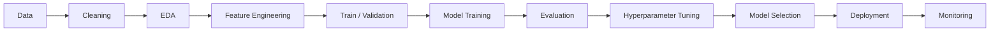

# ⚡ AI · ML · Data Science · Software Engineering

<p align="center">
  
  
  
  
  
</p>

<p align="center">

`Artificial Intelligence` · `Machine Learning` · `Deep Learning` · `Data Science` · `Computer Vision` · `NLP` · `Algorithms` · `Software Engineering`

</p>

---

# 🧠 About Me

I am a **Computer Engineering undergraduate at Shiraz University of Technology** focused on **Artificial Intelligence, Machine Learning, Deep Learning, Data Science, Algorithms, and Software Engineering**.

I work primarily with **Python** and the modern machine-learning ecosystem, with an interest in taking projects from data preparation and experimentation through model development, evaluation, and practical deployment.

### 🎯 Core Direction

`Artificial Intelligence` · `Machine Learning` · `Deep Learning` · `Data Science` · `Computer Vision` · `NLP` · `Algorithms` · `Software Engineering`

---

# 🐍 Python Ecosystem

<p align="center">


</p>

---

# 🤖 Machine Learning Stack

## 📐 Classical Machine Learning

### Supervised Learning

* Linear Regression
* Logistic Regression
* Ridge / Lasso
* Decision Trees
* Random Forest
* Support Vector Machines
* K-Nearest Neighbors
* Gradient Boosting
* XGBoost
* LightGBM
* CatBoost

### Unsupervised Learning

* K-Means
* Hierarchical Clustering
* DBSCAN
* Principal Component Analysis
* Dimensionality Reduction
* Feature Engineering
* Feature Selection
* Anomaly Detection

### 🧪 Model Evaluation & Experimentation

`Train / Validation / Test Split` · `Cross-Validation` · `Hyperparameter Tuning` · `Grid Search` · `Random Search` · `Feature Scaling` · `Pipelines` · `Confusion Matrix` · `ROC-AUC` · `Precision` · `Recall` · `F1-Score` · `MAE` · `MSE` · `RMSE` · `R²`

---

# 🧠 Deep Learning

<p align="center">


</p>

### 🔥 Neural Network Areas

`Artificial Neural Networks` · `CNN` · `RNN` · `LSTM` · `GRU` · `Autoencoders` · `Transfer Learning` · `Embeddings` · `Attention` · `Transformers` · `Fine-Tuning` · `Model Evaluation`

---

# 👁️ Computer Vision

### Vision Workflow

```text
Image Processing
       ↓
Preprocessing
       ↓
Augmentation
       ↓
Feature Extraction
       ↓
CNN
       ↓
Transfer Learning
       ↓
Classification
       ↓
Object Detection
       ↓
Evaluation
```

---

# 🗣️ NLP & Generative AI

### NLP Concepts

`Tokenization` · `Embeddings` · `Sequence Modeling` · `Attention` · `Transformers` · `Text Classification` · `Semantic Similarity` · `Information Retrieval` · `LLM Workflows`

---

# 🔎 Vector Search & AI Retrieval

`Embeddings` · `Vector Search` · `Similarity Search` · `Semantic Retrieval` · `RAG Concepts` · `Nearest Neighbor Search`

---

# 🧰 Engineering & MLOps

<p align="center">


</p>

### End-to-End ML Workflow



---

# 🧮 Algorithms & Computer Engineering

`Data Structures` · `Sorting` · `Searching` · `Hashing` · `Trees` · `Heaps` · `Graphs` · `Dynamic Programming` · `Object-Oriented Programming` · `Java` · `C/C++` · `VHDL` · `FSM Design`

---

# 📊 Data Science Workflow

### 🔍 What I Work With

`Missing Values` · `Outliers` · `Encoding` · `Scaling` · `Normalization` · `Feature Engineering` · `Data Visualization` · `Statistical Analysis` · `Model Selection` · `Error Analysis`

---

# 🚀 Featured Projects

## 🔗 Connection Project

Python-based networking project involving a relay architecture with Google Apps Script and Cloudflare Workers.

**Technologies**

`Python` `Docker` `Cloudflare Workers` `Google Apps Script`

## 🌐 Hibik1

A forked project based on G2Ray with a containerized workflow.

**Technologies**

`Docker` `GitHub` `V2Ray Ecosystem`

---

# 📈 GitHub Analytics

---

# 📊 Contribution Activity

---

# 🏆 Achievements & Academic Direction

### 🎓 Computer Engineering

**Computer Engineering**

Shiraz University of Technology

### 🤖 Artificial Intelligence

**Artificial Intelligence**

Machine Learning & Deep Learning

### 🔬 Research

**Research**

Software & Intelligent Systems

### 💻 Development

**Development**

Algorithms & Python Engineering

---

# 📜 Certifications

Professional certifications and learning credentials are maintained through my LinkedIn profile.

---

# 🧩 Current AI/ML Capability Map

| Area                | Technologies / Concepts                            |
| :------------------ | :------------------------------------------------- |
| 🐍 Programming      | Python                                             |
| 📊 Data             | NumPy · Pandas · SciPy                             |
| 📉 Visualization    | Matplotlib · Seaborn                               |
| 🤖 Classical ML     | Scikit-learn · XGBoost · LightGBM · CatBoost       |
| 🧠 Deep Learning    | PyTorch · TensorFlow · Keras                       |
| 👁️ Computer Vision | OpenCV · Torchvision                               |
| 🗣️ NLP             | Transformers · Hugging Face                        |
| 🔎 Vector AI        | FAISS · Chroma · Embeddings                        |
| 🧪 Evaluation       | Cross-Validation · Metrics · Hyperparameter Tuning |
| ⚙️ Engineering      | Git · GitHub · Docker · Linux                      |
| 🚀 Serving          | FastAPI · Model APIs                               |
| 📦 MLOps            | MLflow · Experiment Tracking                       |
| 🧩 Algorithms       | Data Structures · Graphs · Trees · DP · Hashing    |

---

# 🌌 Vision

```text
Learn
  ↓
Experiment
  ↓
Build
  ↓
Evaluate
  ↓
Deploy
  ↓
Improve
```

**Learn → Experiment → Build → Evaluate → Deploy → Improve**

---

<p align="center">


</p>

<p align="center">

<b>Building intelligent systems from data to deployment.</b>

</p>
