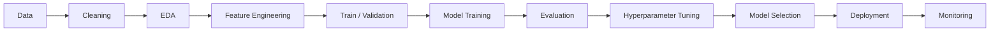

<table>
<tr>
<td align="center">

</td>
</tr>
</table>

 

 

━━━━━━━━━━━━━━━━━━━━━━━━━━━━━━━━━━━━━━━━━━━━━━━━━━━━━━━━━━━━

---

# 🧠 About Me

I am a **Computer Engineering undergraduate at Shiraz University of Technology** focused on **Artificial Intelligence, Machine Learning, Deep Learning, Data Science, Algorithms, and Software Engineering**.

I work primarily with **Python** and the modern machine-learning ecosystem, with an interest in taking projects from data preparation and experimentation through model development, evaluation, and practical deployment.

### 🎯 Core Direction

`Artificial Intelligence` · `Machine Learning` · `Deep Learning` · `Data Science` · `Computer Vision` · `NLP` · `Algorithms` · `Software Engineering`

---

# 🐍 Python Ecosystem

  

 

---

# 🤖 Machine Learning Stack

### 📐 Classical Machine Learning

<table>
<tr>
<td width="50%" valign="top">

**Supervised Learning**

- Linear Regression
- Logistic Regression
- Ridge / Lasso
- Decision Trees
- Random Forest
- Support Vector Machines
- K-Nearest Neighbors
- Gradient Boosting
- XGBoost
- LightGBM
- CatBoost

</td>
<td width="50%" valign="top">

**Unsupervised Learning**

- K-Means
- Hierarchical Clustering
- DBSCAN
- Principal Component Analysis
- Dimensionality Reduction
- Feature Engineering
- Feature Selection
- Anomaly Detection

</td>
</tr>
</table>

### 🧪 Model Evaluation & Experimentation

`Train / Validation / Test Split` · `Cross-Validation` · `Hyperparameter Tuning` · `Grid Search` · `Random Search` · `Feature Scaling` · `Pipelines` · `Confusion Matrix` · `ROC-AUC` · `Precision` · `Recall` · `F1-Score` · `MAE` · `MSE` · `RMSE` · `R²`

---

# 🧠 Deep Learning

  

### 🔥 Neural Network Areas

`Artificial Neural Networks` · `CNN` · `RNN` · `LSTM` · `GRU` · `Autoencoders` · `Transfer Learning` · `Embeddings` · `Attention` · `Transformers` · `Fine-Tuning` · `Model Evaluation`

---

# 👁️ Computer Vision

### Vision Workflow

`Image Processing` → `Preprocessing` → `Augmentation` → `Feature Extraction` → `CNN` → `Transfer Learning` → `Classification` → `Object Detection` → `Evaluation`

---

# 🗣️ NLP & Generative AI

### NLP Concepts

`Tokenization` · `Embeddings` · `Sequence Modeling` · `Attention` · `Transformers` · `Text Classification` · `Semantic Similarity` · `Information Retrieval` · `LLM Workflows`

---

# 🔎 Vector Search & AI Retrieval

`Embeddings` · `Vector Search` · `Similarity Search` · `Semantic Retrieval` · `RAG Concepts` · `Nearest Neighbor Search`

---

# 🧰 Engineering & MLOps

  

### End-to-End ML Workflow

---

# 🧮 Algorithms & Computer Engineering

`Data Structures` · `Sorting` · `Searching` · `Hashing` · `Trees` · `Heaps` · `Graphs` · `Dynamic Programming` · `Object-Oriented Programming` · `Java` · `C/C++` · `VHDL` · `FSM Design`

---

# 📊 Data Science Workflow

<table>
<tr>
<td align="center" width="16%"><strong>01</strong> Collect</td>
<td align="center" width="16%"><strong>02</strong> Clean</td>
<td align="center" width="16%"><strong>03</strong> Explore</td>
<td align="center" width="16%"><strong>04</strong> Engineer</td>
<td align="center" width="16%"><strong>05</strong> Model</td>
<td align="center" width="16%"><strong>06</strong> Evaluate</td>
</tr>
</table>

### 🔍 What I Work With

`Missing Values` · `Outliers` · `Encoding` · `Scaling` · `Normalization` · `Feature Engineering` · `Data Visualization` · `Statistical Analysis` · `Model Selection` · `Error Analysis`

---

# 🚀 Featured Projects

<table>
<tr>
<td width="50%" valign="top">

## 🔗 Connection Project

Python-based networking project involving a relay architecture with Google Apps Script and Cloudflare Workers.

**Technologies**

`Python` `Docker` `Cloudflare Workers` `Google Apps Script`

 

</td>

<td width="50%" valign="top">

## 🌐 Hibik1

A forked project based on G2Ray with a containerized workflow.

**Technologies**

`Docker` `GitHub` `V2Ray Ecosystem`

 

</td>
</tr>
</table>

---

# 📈 GitHub Analytics

  

---

# 📊 Contribution Activity

---

# 🏆 Achievements & Academic Direction

<table>
<tr>
<td align="center" width="25%">

### 🎓
**Computer Engineering**

Shiraz University of Technology

</td>
<td align="center" width="25%">

### 🤖
**Artificial Intelligence**

Machine Learning & Deep Learning

</td>
<td align="center" width="25%">

### 🔬
**Research**

Software & Intelligent Systems

</td>
<td align="center" width="25%">

### 💻
**Development**

Algorithms & Python Engineering

</td>
</tr>
</table>

---

# 📜 Certifications

  

Professional certifications and learning credentials are maintained through my LinkedIn profile.

---

# 🧩 Current AI/ML Capability Map

| Area | Technologies / Concepts |
| :--- | :--- |
| 🐍 Programming | Python |
| 📊 Data | NumPy · Pandas · SciPy |
| 📉 Visualization | Matplotlib · Seaborn |
| 🤖 Classical ML | Scikit-learn · XGBoost · LightGBM · CatBoost |
| 🧠 Deep Learning | PyTorch · TensorFlow · Keras |
| 👁️ Computer Vision | OpenCV · Torchvision |
| 🗣️ NLP | Transformers · Hugging Face |
| 🔎 Vector AI | FAISS · Chroma · Embeddings |
| 🧪 Evaluation | Cross-Validation · Metrics · Hyperparameter Tuning |
| ⚙️ Engineering | Git · GitHub · Docker · Linux |
| 🚀 Serving | FastAPI · Model APIs |
| 📦 MLOps | MLflow · Experiment Tracking |
| 🧩 Algorithms | Data Structures · Graphs · Trees · DP · Hashing |

---

# 🌌 Vision

  

**Learn → Experiment → Build → Evaluate → Deploy → Improve**

---

  

